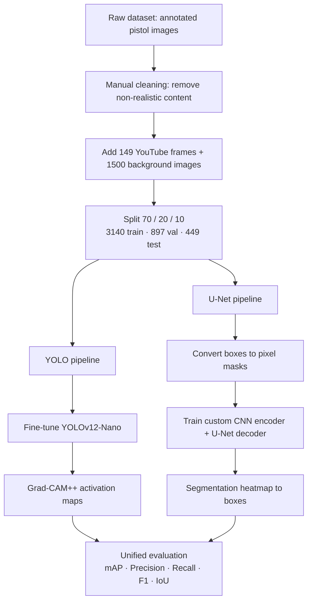

# Explainable Computer Vision for Pistol Detection: YOLO vs. U-Net

[](https://www.python.org/)
[](https://pytorch.org/)
[](https://github.com/ultralytics/ultralytics)
[](LICENSE)
[](https://colab.research.google.com/github/SuleimanAlbalkhi/<REPO-NAME>/blob/main/<NOTEBOOK-NAME>.ipynb)

A Bachelor's thesis project that compares two fundamentally different paradigms for automated handgun detection — a **bounding-box detector (YOLOv12-Nano)** and a **semantic-segmentation model (U-Net)** — and asks a question most weapon-detection papers skip: not just *how accurate* is each model, but *what does it actually look at* when it decides?

The models are evaluated under identical conditions, and their decision behaviour is made visible with **Grad-CAM++** (for YOLO) and **activation masks** (for U-Net), then analysed along three criteria: localization fidelity, context dependence, and stability.

> **Context.** This work was produced within the *Zentrum für angewandte Künstliche Intelligenz Duisburg* (ZaKI.D) at the University of Duisburg-Essen. It studies detection for security/surveillance use cases on a public academic dataset; no model weights or raw imagery are redistributed here.

---

## TL;DR — the headline result

On a held-out test set of **449 images**, YOLOv12-Nano decisively outperformed the U-Net baseline. The more interesting finding is *why*: the gap is driven by the **error structure** of each model (false positives from context-diffuse activations), not by raw localization accuracy.

| Model | mAP@50 | mAP@50–95 | Precision | Recall | F1 | mean IoU |
|---|:---:|:---:|:---:|:---:|:---:|:---:|
| **YOLOv12-Nano** | **0.853** | **0.666** | **0.958** | **0.898** | **0.927** | **0.904** |
| U-Net (box-reconstructed) | 0.406 | 0.220 | 0.256 | 0.500 | 0.339 | 0.796 |

**Read the numbers carefully:** mean IoU differs only modestly (0.90 vs. 0.80), while Precision collapses (0.96 vs. 0.26). In other words, when U-Net *does* hit an object it localizes it reasonably — it just fires far too often in the wrong places. Explainability analysis explains exactly that: YOLO activates selectively on discriminative gun parts, while U-Net spreads activation over hands, arms and background.

---

## Why this matters

Automated weapon detection in video surveillance lives or dies on its **false-alarm rate**. A model with high recall but low precision floods operators with false positives and erodes trust in the system. At the same time, high-accuracy deep models are typically **black boxes**: strong metrics tell you *that* a model is right, not *whether it is right for the right reasons*.

This project treats explainability as a first-class evaluation dimension rather than an afterthought — directly relevant to trustworthy-AI and AI-governance concerns in safety-critical deployments.

---

## Approach

Two pipelines are trained and evaluated on the **same data** and the **same metrics**, so the comparison is at the paradigm level rather than a tuned-vs-untuned mismatch.



**YOLO pipeline.** A pretrained `YOLOv12-Nano` is fine-tuned with Ultralytics on a single `pistol` class. Grad-CAM++ (via `pytorch-grad-cam`) is applied to the last convolutional layers before the detection head to visualize which regions drive each detection.

**U-Net pipeline.** A custom 6-block CNN (`3 → 16 → 32 → 64 → 128 → 256 → 416`) is first trained as a binary `pistol / no_pistol` classifier, then reused as a **pretrained encoder** inside a U-Net with skip connections. The decoder reconstructs a single-channel segmentation heatmap, which is converted to bounding boxes so both models are scored with identical detection metrics.

---

## Explainability findings (the core contribution)

The quantitative gap is explained consistently by the qualitative activation analysis:

| Criterion | YOLOv12-Nano | U-Net |
|---|---|---|
| **Localization fidelity** | Selective activation on discriminative parts (slide, barrel, trigger/grip region); stays inside the target box | Diffuse, area-based activation that spills over object borders |
| **Context dependence** | Low — hands/background contribute only weak activation | High — hands, arms and nearby regions are systematically included |
| **Instance separation** | Clear separation between multiple guns | Merges multiple instances into one connected region |
| **Stability** | Consistent focus on the same sub-structures across scenes | Consistent, but consistently *spread out* |

This is the link between explanation and metric: YOLO's object-centric activation → **13 false positives**; U-Net's context-integrating activation → **482 false positives**.

<!-- Add your Grad-CAM++ / heatmap figures here. Suggested: save a few result images under docs/images/ and reference them.


-->

---

## Detailed results

### Confusion matrices (449-image test set)

**YOLOv12-Nano**

| | Predicted: object | Predicted: none |
|---|:---:|:---:|
| **GT: object** | 298 (TP) | 34 (FN) |
| **GT: none** | 13 (FP) | 34 (TN) |

**U-Net**

| | Predicted: object | Predicted: none |
|---|:---:|:---:|
| **GT: object** | 166 (TP) | 166 (FN) |
| **GT: none** | 482 (FP) | 124 (TN) |

YOLO's FP:TP ratio is ~1:23; U-Net's is ~3:1 — the single clearest driver of the precision gap.

---

## Repository structure

```text
<REPO-NAME>/
├── <NOTEBOOK-NAME>.ipynb     # main notebook (training, Grad-CAM++, evaluation)
├── requirements.txt
├── docs/
│   └── images/               # result figures for this README
├── LICENSE
└── README.md
```

> Adjust to match your actual files. If the notebook is large, keep outputs saved so the metrics table and Grad-CAM++ figures render directly on GitHub.

---

## Dataset

Built on the public **University of Granada Pistols Dataset** (via Roboflow):
<https://public.roboflow.com/object-detection/pistols>

Preparation steps applied in this project:
- manual removal of non-realistic / cartoon images (2,973 → 2,837 pistol images);
- 149 additional frames extracted from public YouTube footage and annotated in YOLO format;
- 1,500 background images (no target) added;
- final set: **4,486 images**, split 70 / 20 / 10 (3,140 / 897 / 449).

**The raw dataset and trained weights are not committed to this repository.** Please obtain the images from the source above and respect its license. Annotations follow the normalized YOLO format `(class_id, x_center, y_center, width, height)`.

---

## Setup

```bash
git clone https://github.com/SuleimanAlbalkhi/<REPO-NAME>.git
cd <REPO-NAME>
pip install -r requirements.txt
```

Core dependencies (see `requirements.txt` for pinned versions):

| Purpose | Packages |
|---|---|
| Deep learning | `torch` 2.9, `torchvision` 0.24 |
| Detection | `ultralytics` 8.4 |
| Explainability | `pytorch-grad-cam` 1.5.5 |
| Data / imaging | `numpy` 2.0, `opencv-python` 4.13, `pillow` 11.3 |
| Metrics / analysis | `scikit-learn` 1.6, `scipy` 1.16 |
| Visualization | `matplotlib` 3.10 |

---

## Reproduce

The full pipeline runs in Google Colab on a single **NVIDIA T4 GPU** — click the Colab badge at the top, or:

1. Open `<NOTEBOOK-NAME>.ipynb` in Colab.
2. Point the data cell at your copy of the dataset.
3. Run all cells: YOLO fine-tuning → Grad-CAM++ → U-Net training → unified evaluation.

**Reproducibility.** A fixed seed (`SEED = 42`) is set for Python, NumPy and PyTorch, with `cudnn.deterministic = True` and `cudnn.benchmark = False`. The 50-image explainability sample is selected deterministically and saved to disk so YOLO and U-Net are analysed on identical inputs.

Key training settings:

| | YOLOv12-Nano | CNN encoder | U-Net |
|---|---|---|---|
| Epochs | 100 | 40 (early stop, patience 5) | 40 (early stop, patience 5) |
| Input | 416×416 | — | 416×416 |
| Batch | 16 | 32 | — |
| Optimizer | Ultralytics default | Adam, lr 5e-4, wd 5e-4 | Adam, lr 5e-5 |
| Loss | Ultralytics default | CrossEntropy | BCEWithLogits, pos_weight 5.0 |

---

## Limitations

Reported honestly, as in the thesis:

- **Annotation type.** The dataset provides bounding boxes only; U-Net masks were derived from boxes, so they encode no exact object contours. This favours blobby, context-heavy activations and likely amplifies U-Net's measured context dependence.
- **Not a fair architecture race.** YOLOv12-Nano is a highly optimized production detector; the U-Net was implemented and trained from scratch for this study. The comparison is between *paradigms* under fixed conditions, not between equally tuned systems.
- **Sample size for XAI.** The qualitative analysis rests on a deterministic 50-image sample — informative, but indicative rather than fully generalizable.
- **Explainability ≠ causality.** Grad-CAM++ produces sensitivity-based relevance maps, not causal explanations; highlighted regions show where the model reacts, not necessarily why.

Future directions include contour-accurate segmentation annotations, instance-segmentation baselines, YOLO+U-Net hybrids, and turning the three qualitative criteria (localization fidelity, context dependence, stability) into formal, quantitative metrics.

---

## Citation

If you reference this work:

```bibtex
@thesis{albalkhi2026explainable,
  title  = {Explainable Computer Vision for Pistol Detection: YOLO vs. U-Net},
  author = {Albalkhi, Suleiman},
  school = {University of Duisburg-Essen},
  year   = {2026},
  type   = {Bachelor's thesis}
}
```

Supervisors: Prof. Dr. Torben Weis and Prof. Dr. Gregor Schiele; advisor: Gérald Kämmerer.

---

## Acknowledgments

Produced within the project **Zentrum für angewandte Künstliche Intelligenz Duisburg (ZaKI.D)**, funded through the 5-Standorte-Programm by the German Federal Ministry for Economic Affairs and Energy (BMWi) and the Ministry of Economic Affairs, Industry, Climate Action and Energy of North Rhine-Westphalia (MWIKE NRW) — funding no. 11-09862.

---

## License

Code in this repository is released under the [MIT License](LICENSE). The underlying dataset is governed by its own license (see the University of Granada / Roboflow source above) and is **not** included here.
